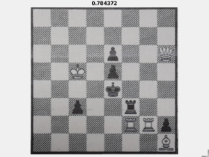

# chessProject
progetto esame elaborazione delle immagini Giugno 2018

## Documentazione delle funzioni del progetto

# prima parte progetto
La prima parte del progetto si occupa di estrarre dall'immagine originale la scacchiera.

#### readImages(aux)
  funzione che carica le immagini nell'intervallo specificato, trasforma in double
  * **input** due valori interi che indicano l'intervallo delle immagini da analizzare
  * **output** void
  * **parametri:** 0
  * **funzioni MATLAB invocate:** [im2double](https://it.mathworks.com/help/matlab/ref/im2double.html?searchHighlight=im2double&s_tid=doc_srchtitle),
  [imread](https://it.mathworks.com/help/matlab/ref/imread.html?searchHighlight=imread&s_tid=doc_srchtitle),
  [sprintf](https://it.mathworks.com/help/matlab/ref/sprintf.html?searchHighlight=sprintf&s_tid=doc_srchtitle)
  * **invocata da:** tutti gli script di test, script main

### resizeImage
   funzione che si occupa di fare una resize dell'immagine in modo da rendere più veloce e più scalabile tutta la computazione, e di lavorare in un formato standardizzato.
   diminuisce tutte le immagini a un massimo di dimensioni dei 2 lati di 1042 px tenendo le proporzioni originali.
   importante che imresize mantiene le proporzioni
   * **input:** immagine del dataset di immagini da analizzare
   * **output:** array di due elementi , immagine di nuove dimensione , scala usata per le immagini
   * **parametri:** misura massima degli assi  dell'immagine= 1000+42
   * **funzioni MATLAB invocate:**
    [size](https://it.mathworks.com/help/matlab/ref/size.html?searchHighlight=size&s_tid=doc_srchtitle), [imresize](https://it.mathworks.com/help/matlab/ref/imresize.html?searchHighlight=imresize&s_tid=doc_srchtitle)
   * **test**: testResize

#### testResizeImage
   script di  test per la funzione resize
   vengono salvate in variabili separate le dimensioni dell'immagine originale, immagine resized e scala
   in un array boolean test viene verificato stia funzionando correttasmente la 'scalata' di tutte le immagini tramite il calcolo inverso.
   * **funzioni invocate:** readImages

### primaryElaboration
   funzione, seconda possibilità di elaborazione
   sviluppata in modo complementare alla secondaryElaboration, per poter individuare le scacchiere la dove c'è la presenza di uno sfondo a texture
   * **input:** immagine già nella dimensione stabilita per l'elaborazione
   * **output:** immagine in bianco e nero pronta per il riconoscimento dei componenti
<<<<<<< HEAD
   * **parametri:** misure dischi (!!!scrivere il perchè dopo aver fatto il ripasso)
   * **funzioni MATLAB invocate:** [size](https://it.mathworks.com/help/matlab/ref/size.html?searchHighlight=size&s_tid=doc_srchtitle), [rgb2gray](https://it.mathworks.com/help/matlab/ref/rgb2gray.html?searchHighlight=rgb2gray&s_tid=doc_srchtitle), [im2double](https://it.mathworks.com/help/matlab/ref/im2double.html?searchHighlight=im2double&s_tid=doc_srchtitle), [imopen](https://it.mathworks.com/help/images/ref/imopen.html?searchHighlight=imopen&s_tid=doc_srchtitle),
=======
   * **parametri:** misure dischi
   * **matlab functions:** [size](https://it.mathworks.com/help/matlab/ref/size.html?searchHighlight=size&s_tid=doc_srchtitle), [rgb2gray](https://it.mathworks.com/help/matlab/ref/rgb2gray.html?searchHighlight=rgb2gray&s_tid=doc_srchtitle), [im2double](https://it.mathworks.com/help/matlab/ref/im2double.html?searchHighlight=im2double&s_tid=doc_srchtitle), [imopen](https://it.mathworks.com/help/images/ref/imopen.html?searchHighlight=imopen&s_tid=doc_srchtitle),
>>>>>>> ae8614baef9fd6275b7db078c385884074613ad6
   [imclose](https://it.mathworks.com/help/images/ref/imclose.html?searchHighlight=imclose&s_tid=doc_srchtitle), [strel](https://it.mathworks.com/help/images/ref/strel.html?searchHighlight=strel&s_tid=doc_srchtitle),
   [imbinarize](https://it.mathworks.com/help/images/ref/imbinarize.html?searchHighlight=imbinarize&s_tid=doc_srchtitle)
   * **test:** testPrimaryElaboration

#### testPrimaryElaboration
   script di test per la funzione primaryElaboration
   vengono caricate, elaborate, e mostratre a video, le immagini originali e quelle elaboborate
   * **funzione invocate:** readImages, rersizeImage, textureElaboration

### secondaryElaboration
   funzione, prima possibilità di elaborazione
   porta l'immagine a livelli di grigi se necessario, elabora tramite equalizzazione dell istogramma e sogliatura immagine con soglia individuata tramite Otsu.
   * **input:** immagine già nella dimensione stabilita per l'elaborazione, boolean per il testing
   * **output:** immagine in bianco e nero pronta per il riconoscimento delle componenti
<<<<<<< HEAD
   * **parametri:** misura disco =6= per tentativi dopo aver stimato sulle prime 20 immagini che doveva essere 4,6,8 o 10 (!!!scrivere il perchè in due parole)
   * **funzioni MATLAB invocate:** [size](https://it.mathworks.com/help/matlab/ref/size.html?searchHighlight=size&s_tid=doc_srchtitle), [rgb2gray](https://it.mathworks.com/help/matlab/ref/rgb2gray.html?searchHighlight=rgb2gray&s_tid=doc_srchtitle), [adapthisteq](https://it.mathworks.com/help/images/ref/adapthisteq.html?searchHighlight=adapthisteq&s_tid=doc_srchtitle), [imclose](https://it.mathworks.com/help/images/ref/imclose.html?searchHighlight=imclose&s_tid=doc_srchtitle), [strel](https://it.mathworks.com/help/images/ref/strel.html?searchHighlight=strel&s_tid=doc_srchtitle), [graythresh](https://it.mathworks.com/help/images/ref/graythresh.html?searchHighlight=graythresh&s_tid=doc_srchtitle), [imbinarize](https://it.mathworks.com/help/images/ref/imbinarize.html?searchHighlight=imbinarize&s_tid=doc_srchtitle)
=======
   * **parametri:** misura disco
   * **matlab functions:** [size](https://it.mathworks.com/help/matlab/ref/size.html?searchHighlight=size&s_tid=doc_srchtitle), [rgb2gray](https://it.mathworks.com/help/matlab/ref/rgb2gray.html?searchHighlight=rgb2gray&s_tid=doc_srchtitle), [adapthisteq](https://it.mathworks.com/help/images/ref/adapthisteq.html?searchHighlight=adapthisteq&s_tid=doc_srchtitle), [imclose](https://it.mathworks.com/help/images/ref/imclose.html?searchHighlight=imclose&s_tid=doc_srchtitle), [strel](https://it.mathworks.com/help/images/ref/strel.html?searchHighlight=strel&s_tid=doc_srchtitle), [graythresh](https://it.mathworks.com/help/images/ref/graythresh.html?searchHighlight=graythresh&s_tid=doc_srchtitle), [imbinarize](https://it.mathworks.com/help/images/ref/imbinarize.html?searchHighlight=imbinarize&s_tid=doc_srchtitle)
>>>>>>> ae8614baef9fd6275b7db078c385884074613ad6
   * **test:** testSecondaryElaboration  

#### testSecondaryElaboration
   script di test per la funzione secondaryElaboration
   vengono caricate, elaborate, e mostratre a video, le immagini originali e quelle elaboborate
   * **funzione invocate:** readImages, resizeImage, secondaryElaboration

### chessDiscover
   funzione che si occupa di individuare la scacchiera.
   sfruttando le bounding box va a cercare le bounding box quadrate, con un errore del 20%,  per poi selezionare quella più grande. (da aggiungere un controllo sulle diagonali =, forse anche pitagora)
   * **input:** immagine elaborata(per ora da elaborationOne), la scala dell'immagine elaborata(output di resizeImage), immagine originale.
   * **output:** la probabile chessboard sotto forma di struct contenente boundingbox, convexarea, convexImage ed scacchiera ritagliata dall'immagine originale
<<<<<<< HEAD
   * **parametri:**  errore di approssimazione dei lati = 0.20= stimato sulle prime 10 immagini, considerando che è solo un primo passaggio il secondo verrà poi implementato (dopo si può un po' abbassare )
   * **funzioni MATLAB invocate:** [regionprops](https://it.mathworks.com/help/images/ref/regionprops.html?searchHighlight=regionprops&s_tid=doc_srchtitle),
=======
   * **parametri:**  errore di approssimazione dei lati = 0.18
   * **matlab functions:** [regionprops](https://it.mathworks.com/help/images/ref/regionprops.html?searchHighlight=regionprops&s_tid=doc_srchtitle),
>>>>>>> ae8614baef9fd6275b7db078c385884074613ad6
   [sort](https://it.mathworks.com/help/matlab/ref/sort.html?searchHighlight=sort&s_tid=doc_srchtitle),
   [fliplr](https://it.mathworks.com/help/matlab/ref/fliplr.html?searchHighlight=fliplr&s_tid=doc_srchtitle) (guardare anche le funzioni invocate per il test)
   * **test:** testChessDiscover

#### testChessDiscover
  script di test per la funzione chessDiscover
  vengono caricate, elaborate, e mostratre a video, le immagini originale tagliate e la maschera dell'immagine binaria tagliata
  * **funzione invocate:** readImages, resizeImage, elaborationOne, chessDiscover

#### cornersMask(aux)
  funzione che si occupa di individuare i 4 corner di una maschera binaria che riceve in input.
  * **input:** maschera binaria figura bianco su sfondo nero
  * **output:** matrice con i 4 corner
  * **parametri:** 0
  * **funzioni MATLAB invocate:** [find](https://it.mathworks.com/help/matlab/ref/find.html?searchHighlight=find&s_tid=doc_srchtitle)
  * **invocata da:** straightnessChess, (la userò anche per  controllare le diagonali)

### straightensChess
  funzione che si occupa di raddrizzare la scacchiera all'interno della boundingBox che la contiene.
  * **input:** immagine boundingBox da raddrizzare , maschera immagine boundingbox da raddrizzare
  * **output:** immagine raddrizzata
  * **prametri:** 0
  * **funzioni MATLAB invocate:**
  [size](https://it.mathworks.com/help/matlab/ref/size.html?searchHighlight=size&s_tid=doc_srchtitle), [imresize](https://it.mathworks.com/help/matlab/ref/imresize.html?searchHighlight=imresize&s_tid=doc_srchtitle),
  [fitgeotrans](https://it.mathworks.com/help/images/ref/fitgeotrans.html?s_tid=doc_ta) ,
  [imwarp](https://it.mathworks.com/help/images/ref/imwarp.html?searchHighlight=imwarp&s_tid=doc_srchtitle),
  [regionprops](https://it.mathworks.com/help/images/ref/regionprops.html?searchHighlight=regionprops&s_tid=doc_srchtitle),
  [imcrop](https://it.mathworks.com/help/images/ref/imcrop.html?searchHighlight=imcrop&s_tid=doc_srchtitle)
  * **test:** testStraightensChess

#### testStraightensChess
  script di test per la funzione testStraightensChess
  vengono mostrate a video le immagini,() interne alla più grossa boundingbox quadrata ) rispettivamente prima di essere raddrizate e successivamente
  * **funzioni invocate:**   readImages, resizeImage, elaborationOne, chessDiscover,  straightensChess

### isChessBoard
  funzione che si occupa di stimare una percentuale che indica la probabilità che l'immagine passata sia effivamente una scacchiera.
  * **input:** immagine (presunta scacchiera)
  * **output:** valore numerico 0<x<1
  * **parametri:** disco di dimensione 3 (!!! scrivere perchè dopo il ripasso)
  * **funzioni MATLAB invocate:** [rgb2gray](https://it.mathworks.com/help/matlab/ref/rgb2gray.html?searchHighlight=rgb2gray&s_tid=doc_srchtitle),
  [size](https://it.mathworks.com/help/matlab/ref/size.html?searchHighlight=size&s_tid=doc_srchtitle),
  [imread](https://it.mathworks.com/help/matlab/ref/imread.html?searchHighlight=imread&s_tid=doc_srchtitle),
  [rgb2gray](https://it.mathworks.com/help/matlab/ref/rgb2gray.html?searchHighlight=rgb2gray&s_tid=doc_srchtitle),
  [imbinarize](https://it.mathworks.com/help/images/ref/imbinarize.html?searchHighlight=imbinarize&s_tid=doc_srchtitle), [imopen](https://it.mathworks.com/help/images/ref/imopen.html?searchHighlight=imopen&s_tid=doc_srchtitle),
  [imresize](https://it.mathworks.com/help/matlab/ref/imresize.html?searchHighlight=imresize&s_tid=doc_srchtitle),
  [corr2](https://it.mathworks.com/help/images/ref/corr2.html?searchHighlight=corr2&s_tid=doc_srchtitle)
  * **test:** testIsChessboard

#### testIsChessboard
  script di test per la funzione isChessboard
  * **funzioni invocate:**  isChessboard, readImages, resizeImage, elaborationOne, chessDiscover,  straightensChess.

### chooseElaboration
  funzione che si occupa di stabilire se la presuntaScacchiera trovata con secondaryElaboration è effettivamente una scacchier.
  se è una scacchiera ma viene tagliata male, stabilisce la migliore tra le due elaborazioni.
  * **input:** immagine ridimensionata, scala del ridimensionamento, immagine originale
  * **output:** immagine scacchiera
  * **parametri:** stiama scacchiera=0.60

#### testFirstHalfPipe
  test che accorpora tutti i test sviluppati fino a questo punto, mostrando in successione tutti i risultati dii ogni test.
  * **funzioni invocate:**   readImages, resizeImage, chooseElaboration

  fine prima parte progetto--------------------------------------------------------------------------------

#### fenGenerator
  funzione che si occupa di creare la stringa FEN partendo dall'immagine ritagliata e raddrizzata della scacchiera. Per individuare i pezzi utilizza la correlazione incrociata normalizata. Questa funzione crea la matrice degli indici che passa poi alla funzione fenString che restituirà la stringa FEN.
  * **input:** immagine della scacchiera ritagliata e raddrizzata, dataset dei pezzi per il match ed il n° dell'immagine che si sta analizzando.
  * **output:** stringa FEN, angolo di rotazione della scacchiera, percentuale di riconoscimento.
  * **funzioni invocate:** findSquare, fenString.
  * **funzioni MATLAB invocate:**
  [rgb2gray](https://it.mathworks.com/help/matlab/ref/rgb2gray.html?s_tid=doc_ta),
  [imadjust](https://it.mathworks.com/help/images/ref/imadjust.html?searchHighlight=imadjust&s_tid=doc_srchtitle),
  [zeros](https://it.mathworks.com/help/matlab/ref/zeros.html?searchHighlight=zeros&s_tid=doc_srchtitle),
  [normxcorr2](https://it.mathworks.com/help/images/ref/normxcorr2.html?s_tid=doc_ta),
  [abs](https://it.mathworks.com/help/matlab/ref/abs.html?searchHighlight=abs&s_tid=doc_srchtitle),
  [max](https://it.mathworks.com/help/matlab/ref/max.html?searchHighlight=max&s_tid=doc_srchtitle),
  [rot90](https://it.mathworks.com/help/matlab/ref/rot90.html?searchHighlight=rot90&s_tid=doc_srchtitle),
  [find](https://it.mathworks.com/help/matlab/ref/find.html?searchHighlight=%5Bfind%5D&s_tid=doc_srchtitle),
  [imrotate](https://it.mathworks.com/help/images/ref/imrotate.html?searchHighlight=imrotate&s_tid=doc_srchtitle)

#### extractCells
  funzione che ritaglia dalla scacchiera le singole celle.
  * **input:** imaggine scacchiera ritagliata e raddrizzata.
  * **output:** singole celle in oggetto di tipo "cell".
  * **funzione invocata da:** fenGenerator
  * **funzioni MATLAB invocate:**
[size](https://it.mathworks.com/help/matlab/ref/size.html?searchHighlight=size&s_tid=doc_srchtitle),
[floor](https://it.mathworks.com/help/matlab/ref/floor.html?searchHighlight=%5Bfloor%5D&s_tid=doc_srchtitle),
[cell](https://it.mathworks.com/help/matlab/ref/cell.html?searchHighlight=%5Bcell%5D&s_tid=doc_srchtitle),
[imresize](https://it.mathworks.com/help/matlab/ref/imresize.html?searchHighlight=imresize&s_tid=doc_srchtitle),
[imshow](https://it.mathworks.com/help/matlab/ref/imshow.html?searchHighlight=%5Bimshow%5D&s_tid=doc_srchtitle),
[waitfor](https://it.mathworks.com/help/matlab/ref/waitfor.html?searchHighlight=%5Bwaitfor%5D&s_tid=doc_srchtitle),

#### fenString
  funzione che crea la stringa fen partendo dalla matrice degli indici dei pezzi trovata grazie alla funzione fenGenerator.
  * **input:** matrice contenente i vari indici dei pezzi, n° immagine che si sta analizzando.
  * **output:** stringa fen, percentuale riconoscimento.
  * **funzione invocata da:** fenGenerator
  * **funzioni invocate:** fenStringApp, wrongFen.
  * **funzioni MATLAB invocate:** [reshape](https://it.mathworks.com/help/matlab/ref/im2double.html?searchHighlight=im2double&s_tid=doc_srchtitle)

#### fenStringApp
  funzione che crea la stringa fen partendo da una stringa composta dalle iniziali dei pezzi.
  * **input:** stringa con le iniziali dei pezzi e n° immagine che si sta analizzando.
  * **output:** stringa fen e un vaore tra 0(non completamente correta) e 100(completaamente corretta).
  * **funzione invocata da:** fenString.
  * **funzione invocata:** checkFen.
  * **funzioni MATLAB invocate:**
[strcat](https://it.mathworks.com/help/matlab/ref/strcat.html?searchHighlight=%5Bstrcat%5D&s_tid=doc_srchtitle),
[num2str](https://it.mathworks.com/help/matlab/ref/num2str.html?searchHighlight=%5Bnum2str%5D&s_tid=doc_srchtitle)

#### checkFen
  funzione che verifica se la stringa fen è corertta (ritorna 100) o incorretta (ritorna 0).
  * **input:** stringa fen e n° immagine che si sta analizzando.
  * **output:** un numero tra 100(riconosciuta) e 0 (non riconosciuta).
  * **funzione invocata da:** fenStringApp.
  * **funzioni MATLAB invocate:**
[sprintf](https://it.mathworks.com/help/matlab/ref/sprintf.html?searchHighlight=%5Bsprintf%5D&s_tid=doc_srchtitle),
[fopen](https://it.mathworks.com/help/matlab/ref/fopen.html?searchHighlight=%5Bfopen%5D&s_tid=doc_srchtitle),
[fscanf](https://it.mathworks.com/help/matlab/ref/fscanf.html?searchHighlight=%5Bfscanf%5D&s_tid=doc_srchtitle),
[strcmp](https://it.mathworks.com/help/matlab/ref/strcmp.html?searchHighlight=%5Bstrcmp%5D&s_tid=doc_srchtitle)

#### wrongFen
  funzione che controlla di quanto è sbagliata la stringa fen e ritorna la percentuale di correttezza e i pezzi che ha sbagliato a riconoscere.
  * **input:** stringa iniziali pezzi in versione estesa e n° dell'immagine che sta analizzando.
  * **output:** percentuale di pezi trovati correttamente e stringa contenente i pezzi che sono stati scambiati.
  * **funzione invocata da:** fenString.
  * **funzione invocata:** expandFen.
  * **funzioni MATLAB invocate:**
[sprintf](https://it.mathworks.com/help/matlab/ref/sprintf.html?searchHighlight=%5Bsprintf%5D&s_tid=doc_srchtitle),
[fopen](https://it.mathworks.com/help/matlab/ref/fopen.html?searchHighlight=%5Bfopen%5D&s_tid=doc_srchtitle),
[fscanf](https://it.mathworks.com/help/matlab/ref/fscanf.html?searchHighlight=%5Bfscanf%5D&s_tid=doc_srchtitle),
[sum](https://it.mathworks.com/help/matlab/ref/sum.html?searchHighlight=%5Bsum%5D&s_tid=doc_srchtitle)
[length](https://it.mathworks.com/help/matlab/ref/length.html?searchHighlight=%5Blength%5D&s_tid=doc_srchtitle),
[strcat](https://it.mathworks.com/help/matlab/ref/strcat.html?searchHighlight=%5Bstrcat%5D&s_tid=doc_srchtitle)

#### expandFen
  funzione che converte la stringa fen in formato esteso(sostituisco i numeri con il carattere 'a' ripetuto il numero di volte corrispondete al numere che sostituisce).
  * **input:** stringa fen in versione estesa.
  * **output:** fen in formato esteso.
  * **funzione invocata da:** wrongFen.
  * **funzioni MATLAB invocate:**
[length](https://it.mathworks.com/help/matlab/ref/length.html?searchHighlight=%5Blength%5D&s_tid=doc_srchtitle),
[str2num](https://it.mathworks.com/help/matlab/ref/str2num.html?searchHighlight=%5Bstr2num%5D&s_tid=doc_srchtitle),
[strcat](https://it.mathworks.com/help/matlab/ref/strcat.html?searchHighlight=%5Bstrcat%5D&s_tid=doc_srchtitle)

#### confusionMat
  funzione che crea la matrice di confusione.
  * **input:** stringhe FEN e intervallo delle immagini analizzate.
  * **output:** matrice di confusione e numero di stringhe fen completamente corrette.
  * **funzione invocata da:** testOCR.
  * **funzioni MATLAB invocate:**
[zeros](https://it.mathworks.com/help/matlab/ref/zeros.html?searchHighlight=zeros&s_tid=doc_srchtitle),
[sprintf](https://it.mathworks.com/help/matlab/ref/sprintf.html?searchHighlight=%5Bsprintf%5D&s_tid=doc_srchtitle),
[fopen](https://it.mathworks.com/help/matlab/ref/fopen.html?searchHighlight=%5Bfopen%5D&s_tid=doc_srchtitle),
[fscanf](https://it.mathworks.com/help/matlab/ref/fscanf.html?searchHighlight=%5Bfscanf%5D&s_tid=doc_srchtitle),
[confusionmat](https://it.mathworks.com/help/search.html?qdoc=confusionmat&submitsearch=),
[size](https://it.mathworks.com/help/matlab/ref/size.html?searchHighlight=size&s_tid=doc_srchtitle),
[num2cell](https://it.mathworks.com/help/matlab/ref/num2cell.html)

#### testOCR
  script di test per la parte della creazione della stringa. Corrisponde ad una chiamata più completa rispetto allo script main
  * **funzioni invocate:** readImages, makeDataset, resizeImage, chooseElaboration, chessDiscover, fenGenerator,confusionMat.
  * **funzioni MATLAB invocate:**
[zeros](https://it.mathworks.com/help/matlab/ref/zeros.html?searchHighlight=zeros&s_tid=doc_srchtitle),
[exist](https://it.mathworks.com/help/matlab/ref/exist.html?searchHighlight=%5Bexist%5D&s_tid=doc_srchtitle),
[load](https://it.mathworks.com/help/matlab/ref/load.html?searchHighlight=%5Bload%5D&s_tid=doc_srchtitle),
[save](https://it.mathworks.com/help/matlab/ref/save.html?searchHighlight=%5Bsave%5D&s_tid=doc_srchtitle),
[cell](https://it.mathworks.com/help/matlab/ref/cell.html?searchHighlight=%5Bcell%5D&s_tid=doc_srchtitle),
[etime](https://it.mathworks.com/help/matlab/ref/etime.html?searchHighlight=%5Betime%5D&s_tid=doc_srchtitle),
[size](https://it.mathworks.com/help/matlab/ref/size.html?searchHighlight=size&s_tid=doc_srchtitle),
[sprintf](https://it.mathworks.com/help/matlab/ref/sprintf.html?searchHighlight=%5Bsprintf%5D&s_tid=doc_srchtitle),
[disp](https://it.mathworks.com/help/matlab/ref/disp.html?searchHighlight=%5Bdisp%5D&s_tid=doc_srchtitle)

#### main
  script per l'esecuzione del progetto in formato base
  * **funzioni invocate:** readImages, makeDataset, resizeImage, chooseElaboration, chessDiscover, fenGenerator.
* **funzioni MATLAB invocate:**
[zeros](https://it.mathworks.com/help/matlab/ref/zeros.html?searchHighlight=zeros&s_tid=doc_srchtitle),
[exist](https://it.mathworks.com/help/matlab/ref/exist.html?searchHighlight=%5Bexist%5D&s_tid=doc_srchtitle),
[load](https://it.mathworks.com/help/matlab/ref/load.html?searchHighlight=%5Bload%5D&s_tid=doc_srchtitle),
[save](https://it.mathworks.com/help/matlab/ref/save.html?searchHighlight=%5Bsave%5D&s_tid=doc_srchtitle),
[cell](https://it.mathworks.com/help/matlab/ref/cell.html?searchHighlight=%5Bcell%5D&s_tid=doc_srchtitle),
[size](https://it.mathworks.com/help/matlab/ref/size.html?searchHighlight=size&s_tid=doc_srchtitle),
[sprintf](https://it.mathworks.com/help/matlab/ref/sprintf.html?searchHighlight=%5Bsprintf%5D&s_tid=doc_srchtitle),
[disp](https://it.mathworks.com/help/matlab/ref/disp.html?searchHighlight=%5Bdisp%5D&s_tid=doc_srchtitle)
=======
>>>>>>> ae8614baef9fd6275b7db078c385884074613ad6
